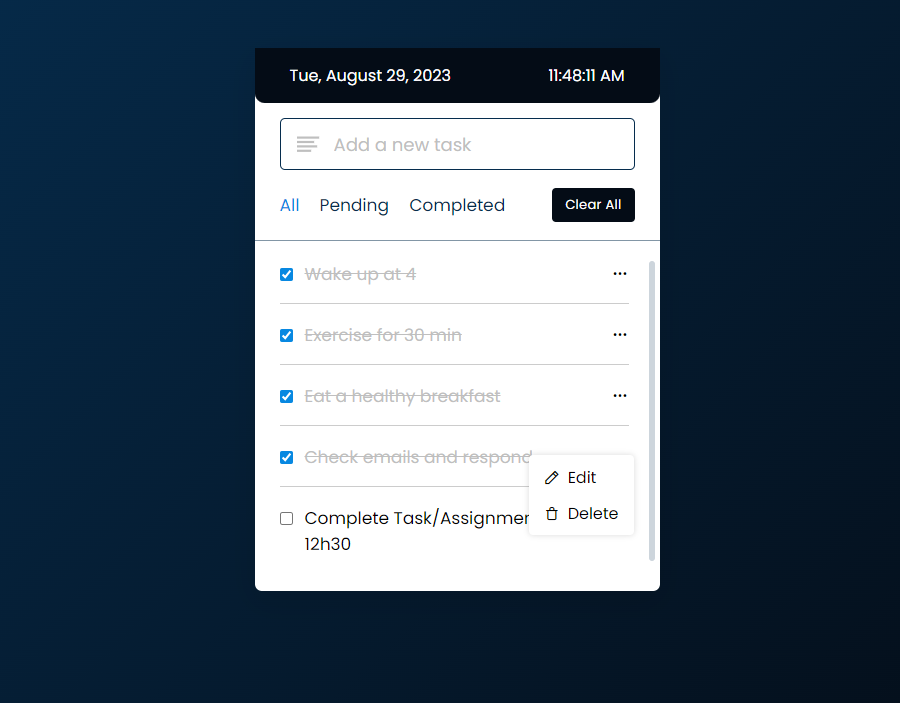

# ToDo App

Welcome to the ToDo App! This simple web application helps you manage your tasks effectively. You can add, edit, and delete tasks, mark them as completed, view pending and completed tasks, clear all tasks, and also see the current date and time.

## Features

- Add tasks: Easily add new tasks to your to-do list.
- Edit tasks: Edit the existing tasks to keep your list up-to-date.
- Delete tasks: Remove tasks that are no longer needed.
- View pending tasks: Filter and view only the tasks that are pending.
- View completed tasks: Filter and view only the tasks that have been completed.
- Clear all tasks: Quickly clear all tasks from your list.
- Mark tasks as completed: Mark individual tasks as completed.
- View date and time: Stay updated with the current date and time.
- Responsiveness: The app is responsive and can be used on various devices.

## Preview

## Contact Information

- Email: isingizwemunezerovictor5@gmail.com
- GitHub: [@iwmvictor](https://github.com/iwmvictor)
- Instagram: [iwmvictor](https://instagram.com/iwmvictor)
- Twitter: [iwmvictor](https://twitter.com/iwmvictor)

## Usage

1. Clone the repository: `git clone https://github.com/iwmvictor/todoapp.git`
2. Open the `index.html` file in a web browser.
3. Start managing your tasks!

## Attribution

Icons used in this project are from [Iconscout](https://unicons.iconscout.com/release/v4.0.0/css/line.css).

## License

This project is not licensed.

Feel free to contribute and improve the ToDo App!

